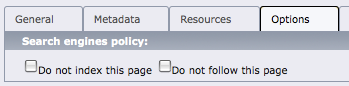

========================
TYPO3 "robots" extension
========================

.. ATTENTION::
   TYPO3 v9 has a `native "seo" extension`__ that provides this extension's features.

__ https://docs.typo3.org/c/typo3/cms-seo/9.5/en-us/Introduction/Index.html

----

This is an extension to the TYPO3 CMS.
It adds options to the page that generate a ``<meta name="robots"/>`` tag.

This allows editors to easily exclude pages from indexing by Google, Bing
and other search engines.

.. contents::
   :depth: 3

.. _introduction:

Introduction
============
.. _what-it-does:

What does it do?
----------------

Currently this extension only adds two checkboxes to the page properties.
These checkboxes allow to specify whether search engines should index and
follow the page or not.
If indexing or following is disabled, extension will create a corresponding tag
on the page.

The same thing can be easily done by TypoScript but it will require either
extension templates or conditions in the main template of the site.
This extension makes robots flags a part of the page.

.. _screenshots:

Screenshots
-----------
Here is how the checkboxes look like in page properties:

The first checkbox will put ``noindex`` and the second will put ``nofollow``
into the ``<meta name="robots"/>`` tag inside ``<head>`` tag.
These checkboxes are TYPO3 exclude fields, so administrator can limit TYPO3
user access to this field if necessary.

.. _user-manual:

Users Manual
============
The checkboxes are available on the "Options" tab in the page properties.
Checking any of them will put corresponding values in the robots tag on the
page.

.. note::

   The extension will detect if the robots tag already exists and will not
   replace an existing tag.

   This way you can still have tags added by TypoScript.

.. _admin-manual:

Administrator Manual
====================

Install extension using extension manager as usual.
After that extension is ready to work.
There is no need to clear cache because processing happens on the
cached content.

License
=======
Just like TYPO3 CMS, this extension is licensed under GPL v2.

Contact
=======
E-Mail: weiske+t3x-robots@mogic.com

Originally written by `Dmitry Dulepov`__.

__ http://www.dmitry-dulepov.com/

Links
=====
- `TYPO3 extension repository page <https://typo3.org/extensions/repository/view/robots>`_
- `TYPO3 extension manual page <https://docs.typo3.org/typo3cms/extensions/robots/>`_
- `Source code <https://github.com/mogic-le/t3x-robots>`_
